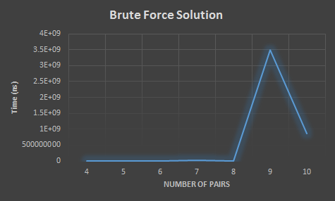
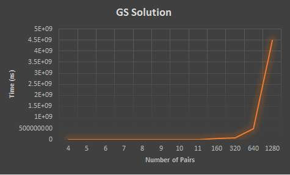

# Lab 1 Report - Stable Matchings

##Part1: Write a report

###(a) Prove that there always exists a perfect matching that is weakly stable.

###(b) Give an algorithm in pseudocode to find a stable assignment.
	
	while there are freeTenants
		get first tenant from the list
		determine this tenant's highest apartment 
		if said apartment is available 
			match tenant to apartment
			remove this tenant from the freeTenants list
		else 
			determine landlord who owns this apartment
			determine current owner of this apartment
			compare preferences of the two tenants trying to get this apartment
			if landlord perfers this new tenant 
				unmatch current owner
				add current owner to free tenants list
				match this new tenant with apartment
				remove tenant from free tenants list
			endif
		endif
		mark highest apartment as being proposed to by this tenant
	endwhile

###(c) Give proof of algorithm's correctnes. Prove both that algorithm terminates and that it gives a correct result.
//perfect matching && weakly stable matching 
Please refer to letter (d) for proof of algorithm termination.

Suppose there is a point where there is a free tenant T and they have already asked to be matched to every apartment. Since each apartment remains with a tenant since they have been asked to pair up, then at this time every apartment has a tenant. Since the set of matched up pairs forms a matching, then N tenants must also be paired up. But there are only N tenants total, and T is not paired to an apartment. A contradiction. So if a tenant is free at some point, then there is an apartment who the tenant has not asked for. 

Suppose that the algorithm terminates with a free tenant. It would be the case that the tenant has asked for each apartment or else the while loop would have not terminated. This contradicts the above satement which says there cannot be a free tenant who has asked for every apartment. Thus the set P returned at the termination of the algorithm is a perfect matching. 

Now I will show that the set P will be a weakly stable matching. Please refer to the lab1.docx for a clear defenition of a weakly stable matching. From above we can conclude that the set T will be a perfect matching. To prove that the algorithm provides a correct result, a weakly stable matching, we will assume there is an instability with the set T and come up with a contradiction. From lab1.docx, an instability is defined as when one tenant and one apartment prefer each other strictly over their current matchings. This means that when tenants or apartments have no preference there is no instability, there must be a tenant and an apartment that strictly prefer each other than their current matchings. So for example, (T, A) and (T', A') in T have the proporties that T prefers A' to A and A' prefers T to T'.  
###(d) Give the runtime complexity of algorithm in Big-O notation.

Each iteration consists of a tenant trying to get an apartment, an apartment that he/she has not attempted to gain before. Let P(t) denote the set of pairs (T, A) such that T (tenant) has attempted to gain A (apartment) before the end of iteration t, for all t, the size of P(t+1) is greater than the size of P(t). There are only N^2 possible pairs of tenants and apartments in total, so the vaule of P(progress) can increase to at most N^2 times over the course of the algorithm. Hence N^2 iterations, thus O(N^2), where N is the number of tenants.

###(e) Give the runtime complexity of this brute force algorithm in Big-O notation and why.

The runtime complexity of the brute force algorithm is O(N!), where N is the number of tenants (number of tenants and apartments should be the same). With the brute force algorithm we compute every possible outcome and then see if a certain matching is weakly stable. There are N! possible matchings that can be made so it takes us O(N!) to actually make all the pairings. The reason that there are N! possible matchings is because when we pair a tenant and an apartment we care about every last detail. When forming all possible ways to match tenants and apartments we start talking about permutations. With permutations we care about every single detail since order matters.

###(f)  Plot the number of couples (x-axis) against the time in ms it takes for the code to run (y-axis). Have 8 points for GS algorithm and 4-8 points for the brute force method. Take note of the trend in run time as the number of apartments increases.
	
	
