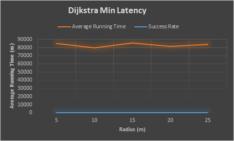

#Programming Assignment 2 - Greedy Algortihm & Graphs
####Josue Alfaro 
####jja2244

##Proofs
a) Give a brief proof which shows that GPSR, while greedy, is not an optimal solution for the wireless routing problem. 

GPSR is a greedy algorithm that decides to add a node, closer to the sink node, to its path. However this is not an optimal solution for the wireless routing problem because it does not consider the weight between to vertices. It purly determines a path based on distance. So while it might find a path down a short distance, the packet might not travel as fast as it would going down a longer path but with much lower latency. Also, from the sourceIndex node, the node that connects to the sourceIndex node and is closests to the sinkIndex might not lead down a path at all. So it can potentially get to a dead end, while there might be a longer path available that actually connects the soureIndex and sinkIndex.

b) Argue that dijkstraPathHops() in general does a better job than GPSR at finding a path with minimum number of hops, but is still not an optimal solution to the routing problem.

dijkstraPathHops() in general does a better job than GPSR at finding a path with minimum number of hops because it does take into consideration the weight between to vertices. So while it is finding the shortest distance, it also takes into account the amount of latency that could occur if the packet where sent down said path. However, this is not a minimal solution because we are considering that the edge weight is one. Also, Disjkstra looks at all of the connected nodes before making a decision and then going down that path. So it won't run into the problems that GPSR can potentially run into.

##Efficiency Analysis
a) Give a Big-O analysis of the memory space efficiency of your graph representation in terms of nodes (n) and edges (e). Discuss any optimizations you made. 

I choose to represent the graph as an adjacency list. Thus, this graph representation requires O(|n|+|e|) space. The graph holds WeightedVertex verticies which require an aditional 16 bytes, but in terms of Big-O this is just a constant addition to the graph, so it does not require more space.

b) Give a Big-O analysis of the runtime complexity of the algorithm you used to generate those graph representations. Justify the design decisions you made in optimising for space versus runtime.

Here is a snippet of the algorithm to compute the graph.

	graph := new ArrayList<ArrayList<WeightedVertex>()
	for each vertex in location 
		graph.add(new ArrayList<WeightedVertex>())
	endfor
	for each edge in edges
		if the distance between two edges is less than transmissionRange
			add WeightedVertex for both edges in their respective graph locations
		endif
	endfor

So this algortihm, takes O(|n|+|e|) runtime to compute the graph. There was no decision in order to optimize for space versus runtime, since both Big-O space for the graph and Big-O runtime to compute the graph are the same. 

c) Bearing in mind the graph representations you have devised for this project and the trade-offs between space requirements and runtime, give a Big-O analysis of the runtime for your implementation of Dijkstra's algortihm. If the runtime is worse than expected, explain why.

My implementation of Dijkstra's algorithm takes O(|n||e|). The way I came about this Big-O analysis was, that I knew the time complexity was going to take O(|e| * Td + |n| * Tm), where Td represents the time it takes to decrease a key and Tm represents the time ti takes to extract the minimum node from the set of unvisited nodes. I used a PriorityQueue to represent the set of unvisted nodes. So the time it takes to find the minimum distance of the set of unvisited nodes is O(logn). The way I implemented the decreasing of the distance key, was to remove a certain node from the PriorityQueue and if it was able to remove it then I update the distance and previous fields of DijkstraVertex class after the update, I re-insert the node into the queue. So this takes a total time of O(n) to remove and O(logn) to add node. Hence this implementation of Dijkstra's algorithm is O(|n||e|). The reason the runtime is worse than the expected run time is because I am using the priority queue's remove method to detect wether or not a node has been visited.

##Runtime Efficiency and Success Rate
a)

GPSR
	Transmission Range: 5.0 meters, success: 4950/4950, avgTime: 3,832ns.
	Transmission Range: 10.0 meters, success: 4950/4950, avgTime: 432ns.
	Transmission Range: 15.0 meters, success: 4950/4950, avgTime: 116ns.
	Transmission Range: 20.0 meters, success: 4950/4950, avgTime: 113ns.
	Transmission Range: 25.0 meters, success: 4950/4950, avgTime: 121ns.

b)

Dijkstra's algorithm (Min Latency)
	Transmission Range: 5.0 meters, success: 4950/4950, avgTime: 84,897ns.
	Transmission Range: 10.0 meters, success: 4950/4950, avgTime: 79,922ns.
	Transmission Range: 15.0 meters, success: 4950/4950, avgTime: 85,595ns.
	Transmission Range: 20.0 meters, success: 4950/4950, avgTime: 81,739ns.
	Transmission Range: 25.0 meters, success: 4950/4950, avgTime: 83,930ns.

c)

Dijkstra's algorithm (Min Hops)
	Transmission Range: 5.0 meters, success: 4950/4950, avgTime: 67,634ns.
	Transmission Range: 10.0 meters, success: 4950/4950, avgTime: 46,064ns.
	Transmission Range: 15.0 meters, success: 4950/4950, avgTime: 39,412ns.
	Transmission Range: 20.0 meters, success: 4950/4950, avgTime: 39,090ns.
	Transmission Range: 25.0 meters, success: 4950/4950, avgTime: 39,214ns.

d) Plot the success rate and the average running time versus the vertex radius for all the above algorithms. Explain the impact of the vertex radius on the performance of the algorithms, and on the basis of that explain when you might prefer GPSR over Dijkstra and vice versa. 

For all three of these charts, when plotted, the success rate is just a horizontal line at 1.0. As you can see above in parts a), b), and c) the success rate was 1, for every single attempt. While on the graph the success rate might look like it is zero, it is not.  

As the radius increases, all of the algorithms tend to perform better in terms of running time. The GPSR algorithm seems much improvement (more than half) when the radius increases, but it also levels off at higher radii. The Dijkstra (Min Latency) algorithm does not see a huge improvement on running time, but it still does perform better as radii increase. The Dijkstra (Min Hops) algorithm sees improvement (about half) when the radius increases, and it also levels off. 